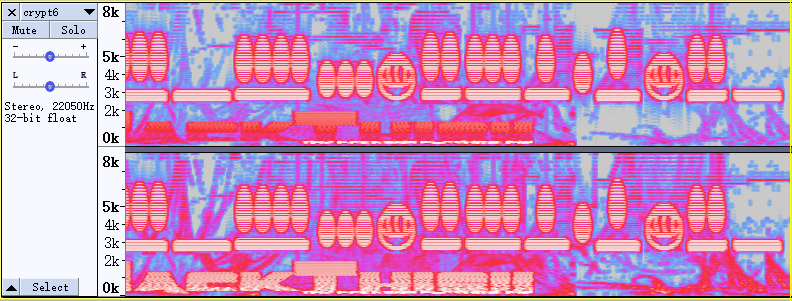

# Aliens

<https://defendtheweb.net/playground/aliens>

## Spectrogram

We can use Audacity to check the spectrogram of this wav file. Then we can get this .

## Mayan Numerals

We have the numbers 69593078616075.

## ASCII

Check <http://www.asciitable.com/>, we can get the .

Note the `Dec` column would give a `record separator` for number 30. Thus we would check for column `Hx`.

- 69,59,30,78,61,60,75.
- iY0xa`u
